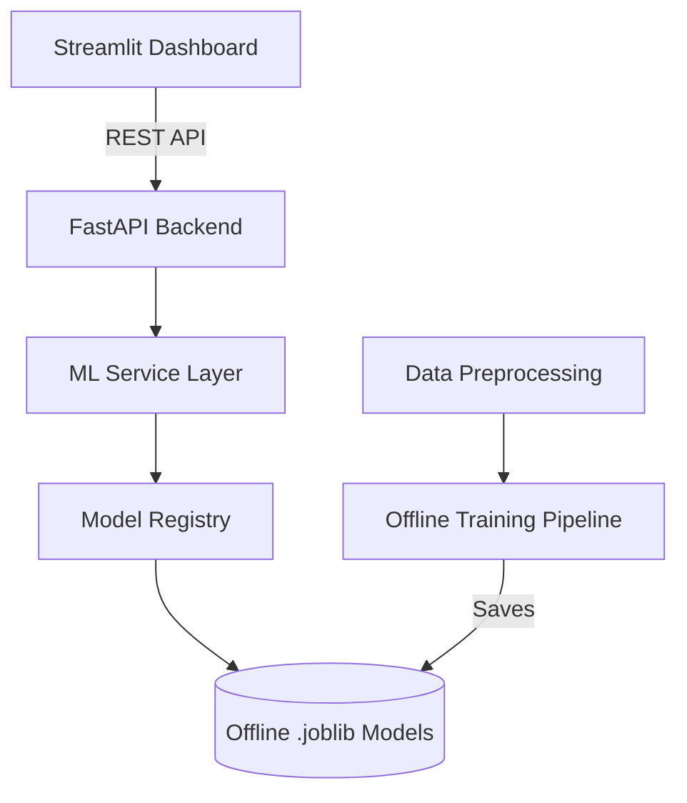

# EV Battery Range Estimator Pro


A world-class, production-ready Machine Learning platform for accurately predicting Electric Vehicle battery range and forecasting long-term capacity degradation. 

## 🚀 Features
- **Advanced Machine Learning**: Uses XGBoost, LightGBM, CatBoost, and Scikit-Learn pipelines.
- **Enterprise Architecture**: Fully decoupled FastAPI backend with lazy-loaded `.joblib` model artifacts.
- **Real-Time Dashboard**: A stunning, modern Streamlit UI featuring Plotly gauges, state management, and scenario tracking.
- **Production-Ready**: Comes out-of-the-box with multi-stage Docker containerization, Pytest, Makefile, and robust logging.

## 🏗️ Architecture



## 🛠️ Setup Instructions

### 1. Install Dependencies
```bash
pip install -r requirements.txt
```

### 2. Train Models Offline (Required First Step)
To eliminate startup latency, models are trained and cached to disk once.
```bash
python scripts/train_models.py
# Or via Makefile:
make train
```

### 3. Start the Backend API
```bash
python -m backend.api.main
```

### 4. Start the Dashboard
```bash
streamlit run frontend/dashboard/app.py
```

## 🐋 Docker Deployment
```bash
docker-compose up --build
```
This will spin up the entire application stack instantly.

## 📡 API Documentation
Once the backend is running, visit `http://localhost:8000/docs` to interact with the auto-generated Swagger UI.

### Example Request (`/api/predict`)
```bash
curl -X 'POST' \
  'http://localhost:8000/api/predict' \
  -H 'Content-Type: application/json' \
  -d '{
  "temperature_c": 20,
  "speed_kmh": 80,
  "payload_kg": 0,
  "hvac_kw": 1,
  "battery_age_cycles": 100,
  "soc_pct": 80,
  "terrain_grade_pct": 0,
  "wind_speed_kmh": 0,
  "battery_capacity_kwh": 75,
  "model_name": "xgboost"
}'
```
